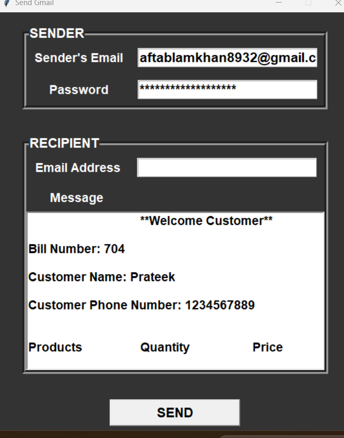

# Billing Software

## Overview
This is a simple billing software application built using Python, Tkinter, and MySQL. The software allows users to enter product details for cosmetics, groceries, and cold drinks, calculate the total price, generate a bill, store the bill details in a MySQL database, and clear the entries. The user interface is designed with Tkinter widgets to ensure ease of use.

## Features
- Add and manage products in different categories: Cosmetics, Groceries, and Cold Drinks.
Calculate the total price including taxes.
Generate a bill with detailed information.
Store bill details in a MySQL database.
Clear all entries.
Exit the application.
Pay Button.

## Prerequisites
Python 3.x
Tkinter (usually included with Python standard libraries)
MySQL database

## Installation
1. Clone the repository:
    ```sh
    git clone https://github.com/Coder-786hub/billing-software.git

    ```
2. Navigate to the project directory:
    ```sh
    cd billing-software

    ```

## Usage
1. Run the main Python file to start the application:
    ```sh
    python main.py
    ```
2. Enter the quantities of products in the respective categories.
3. Click the "Total" button to calculate the total price.
4. Click the "Generate Bill" button to generate and display the bill.
5. Use the "Clear" button to reset all entries.
6. Use the "Exit" button to close the application.

## Code Structure
- **main.py**: The main script that runs the application.
- **Product Frames**: Sections in the UI for entering product details for different categories.
- **Bill Area**: A text area that displays the generated bill.
- **Button Frame**: Contains buttons for calculating totals, generating the bill, clearing entries, and exiting the application.

## Screenshots




## Contributing
1. Fork the repository.
2. Create a new branch:
    ```sh
    git checkout -b feature/YourFeature
    ```
3. Commit your changes:
    ```sh
    git commit -m 'Add some feature'
    ```
4. Push to the branch:
    ```sh
    git push origin feature/YourFeature
    ```
5. Create a new Pull Request.

## License
This project is licensed under the MIT License.

## Acknowledgements
- [Tkinter Documentation](https://docs.python.org/3/library/tkinter.html)
- [Python Documentation](https://docs.python.org/3/)

---


